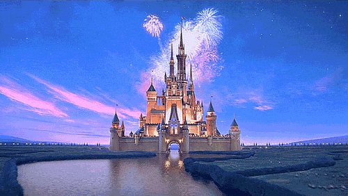
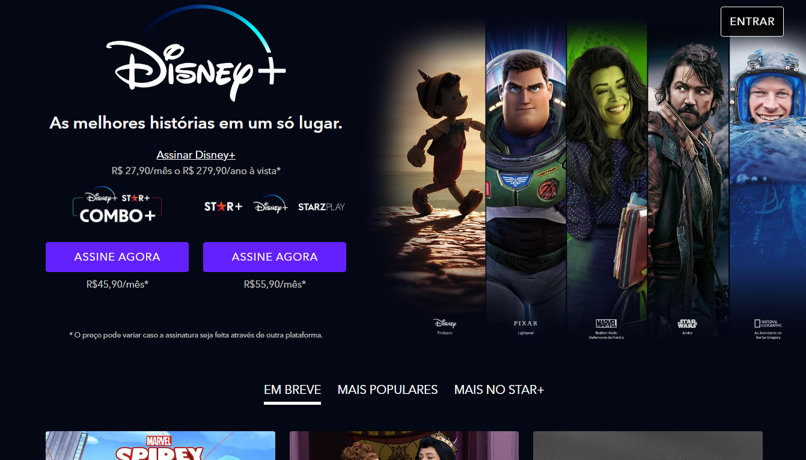
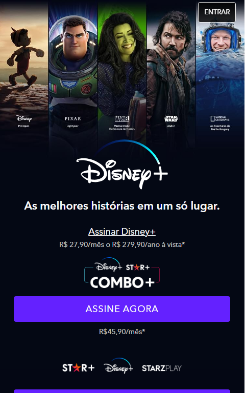

# 
 Clone da Landing Page do Dinsey+

</img>

 

# 🛠 Tecnologias utilizadas:
 

  

  
   
  
  
  
  

 

# 💻  Sobre o Projeto:
<li>Neste projeto eu desenvolvi um clone da landing page antiga da Disney+ utilizando tecnologias como Gulp, SASS e JavaScript. Além disso, foi feito no projeto a implementação da responsividade do layout para diferentes resoluções. 

  

# Visualização Online:

O resultado final do projeto está disponível para visualização online através da plataforma Vercel. Acesse o link abaixo para visualizar o clone da landing page da Disney+:
 
https://clone-disneyplus-nxzm.vercel.app/</li>
 

# 🛠 Ferramentas Utilizadas :
<ul>
        <li>Gulp: Utilizei o Gulp como uma ferramenta de automação de tarefas para melhorar a eficiência do fluxo de trabalho de desenvolvimento.</li>
        <li>SASS: Utilizei o pré-processador SASS para escrever estilos CSS de forma mais eficiente, aproveitando recursos como variáveis, mixins e aninhamento.</li>
        <li>Vercel: A página do Clone do Disney+ está hospedada na Vercel, uma plataforma de hospedagem e implantação de sites. Através do Vercel, conseguimos disponibilizar a página de forma simples e rápida.</li>
        <li>JavaScript: Implementei lógica e interatividade usando JavaScript para aprimorar a experiência do usuário na página.</li>
    </ul>

# 🎨 Pré-visualização :
## Apresentação da Página no PC :

## Apresentação da Página em dispositivos móveis:

# 🦸 Autor:

 
<a href="https://www.linkedin.com/in/jo%C3%A3o-vitor-ribeiro-dias-339a56258/" target="_blank">João Vitor RIbeiro Dias</a>
